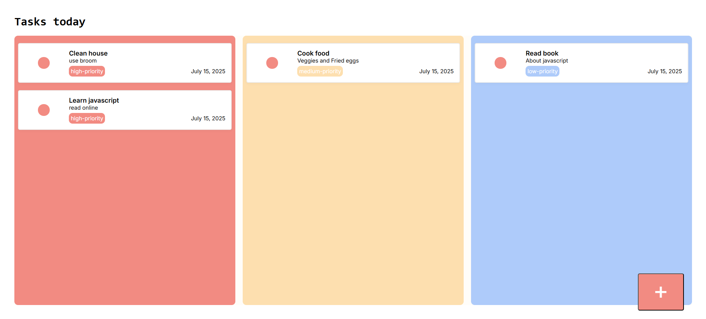
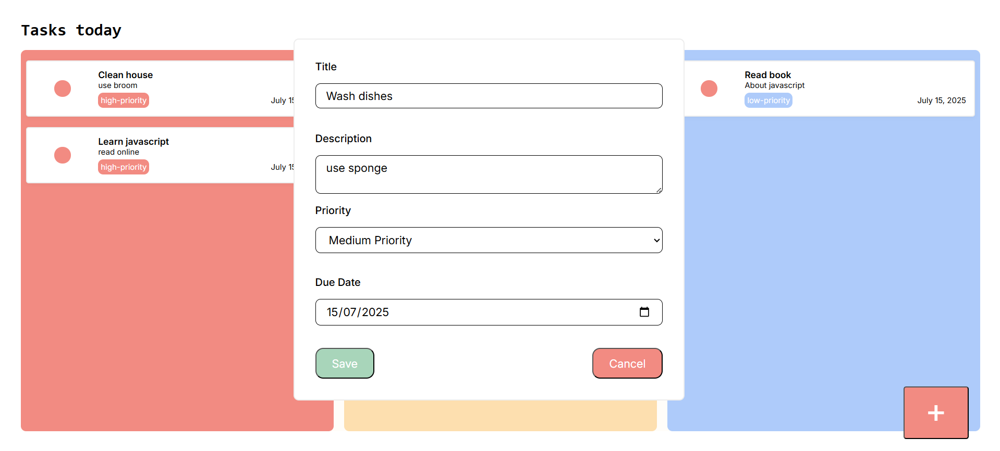

# To-Do List 

To-Do list is a web application develop to help user to track their daily, weekly, and monthly tasks. The application provides different columns for different priorities from highest to lowest for efficient task filtering.

## User Interface

### To-do lists

### To-do list form

## Technologies

### Front End
- HTML
- CSS
- JavaScript
          
## Code Style
This project follows the [Airbnb JavaScript Style Guide](https://github.com/airbnb/javascript)

To ensure consistent formatting across files, [Prettier](https://github.com/prettier/prettier) is used alongside [Eslint](https://github.com/eslint/eslint).

The configuration also includes [eslint-config-prettier](https://github.com/prettier/eslint-config-prettier) to prevent conflicts between ESlint and Prettier rules.

## Features
- [Task Management](#task-management)
- [Sorts tasks based on priority level](#sort-tasks)

### Task Management
Provides user with an intuitive interface for creating, organizing, and tracking tasks to enhance productivity.

### Sort tasks
Tasks are automatically organized into columns based on their priority level, allowing users to quickly identify and focus on the most important tasks first.

## Suggested Improvements
- Data persistence lightweight (local storage API)
- Tags for different events
- sort tasks by dates ASC or DESC
